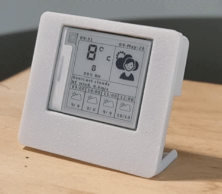
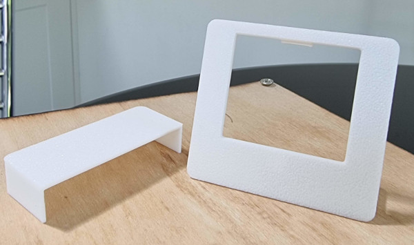
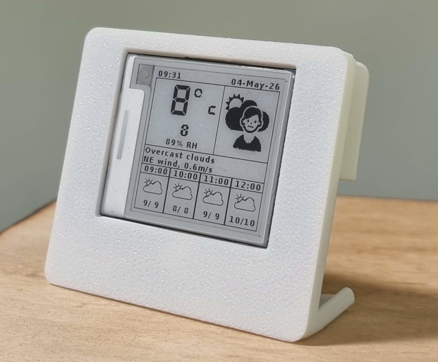
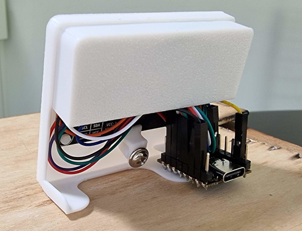

# WeAct 1.54" ePaper Weather Display

This project uses [code from David Bird](https://github.com/G6EJD/ESP32-e-Paper-Weather-Display) and retains his original [copyright and license terms](https://github.com/G6EJD/ESP32-e-Paper-Weather-Display?tab=License-1-ov-file#readme). David's project supports a tonne of different screens (like WaveShare) and sizes, so if you're looking for something other than the WeAct 1.54", please check out [his repo](https://github.com/G6EJD/ESP32-e-Paper-Weather-Display).

The changes I made to his [1.54" example](https://github.com/G6EJD/ESP32-e-Paper-Weather-Display/tree/master/examples/Waveshare_1_54) were to fix the issues I encountered when setting it up for the WeAct 1.54" Module & ESP32 C3 Super.

You'll be able to take this code (the main .ino file) and compare it to David's for the different screen sizes to make it work with WeAct's other displays without much hassle.

# Changes Made for this Project

- Solved my ESP32 C3 Super not connecting to wifi by capping the max wifi power (defaults to 40 & configurable in code)

- Added info re. which WeAct pins go to which ESP32 C3 Super pins

- Added the exact GxEPD2_BW initialisation needed for the WeAct 1.54" SSD1681 module

- Increased the number of API retry attempts to 5, and put a delay of 5 sec between retries

- Added a 60 second delay before deep sleep, allowing you to re-flash the board more easily

- OpenWeather v3 API doesn't have High/Low temps so I've changed the display to show 'Feels Like' instead

- OpenWeather v3 API doesn't have the Forecast so I've changed the display to show the current conditions

- Removed (commented out) the SPI commands from the screen initialisation function.. these were crashing the C3 Super board

- Removed the software version from the top of the display (I didn't need this)

# Wiring Reference

Here's how I hooked up the WeAct 1.54" display to the ESP32 C3 Super, including the wire colours from the included connector cable.

| WeAct Pin | WeAct Wire Colour | ESP32 C3 Pin | ESP32 Feature|
| --- | --- | --- | --- |
|BUSY|Purple|GPIO 1|Mapped in code|
|RES|Orange|GPIO 3|Mapped in code|
|D/C|White|GPIO 2|Mapped in code|
|CS|Blue|GPIO 10|Mapped in code|
|SCL|Green|GPIO 4|SCK|
|SDA|Yellow|GPIO 6|MOSI|
|GND|Black|GND||
|VCC|Red|3.3||

# 3D Printable Stand

For this project I designed a minimalist stand to mount the ePaper module and ESP32 onto. There's an optional (partial) back cover if you want that to hide some of the wires.

The ESP32 C3 Super fits into a clip on the back.. I couldn't figure out a better way to do this; it's functional but not the best.

This model is available on MakerWorld if you'd like to print it.

